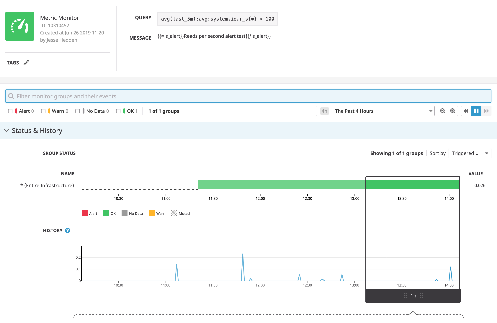
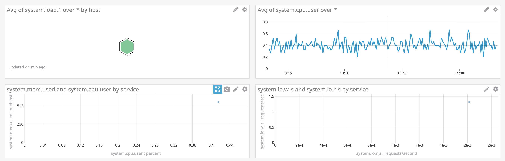

# Webstack Monitoring

This project contains some tasks for learning how to setup monitoring for a webstack on a server using **DATADOG**.

## Tasks To Complete

+ [x] 0. Sign up for Datadog and install datadog-agent
  + Head to [https://www.datadoghq.com/](https://www.datadoghq.com/) and sign up for a free `Datadog` account. When signing up, you'll have the option of selecting statistics from your current stack that `Datadog` can monitor for you. Once you have an account set up, follow the instructions given on the website to install the `Datadog` agent.
  + Sign up for Datadog - **Please make sure you are using the US website of Datagog (.com)**.
  + Install `datadog-agent` on `web-01`.
  + Create an `application key`.
  + Copy-paste in your Intranet user profile ([here](https://alx-intranet.hbtn.io/users/my_profile)) your DataDog `API key` and your DataDog `application key`.
  + Your server `web-01` should be visible in Datadog under the host name `XX-web-01`
    + You can validate it by using this [API](https://docs.datadoghq.com/api/latest/hosts/).
    + If needed, you will need to update the hostname of your server.

+ [x] 1. Monitor some metrics
  + Among the litany of data your monitoring service can report to you are system metrics. You can use these metrics to determine statistics such as reads/writes per second, which can help your company determine if/how they should scale. Set up some `monitors` within the `Datadog` dashboard to monitor and alert you of a few. You can read about the various system metrics that you can monitor here: [System Check](https://docs.datadoghq.com/integrations/system/).
  
  + Set up a monitor that checks the number of read requests issued to the device per second.
  + Set up a monitor that checks the number of write requests issued to the device per second.

+ [x] 2. Create a dashboard _**[2-setup_datadog](2-setup_datadog)**_ contains the id of a dashboard with different metrics displayed in order to get a few different visualizations.
  + Create a new `dashboard`.
  + Add at least 4 `widgets` to your dashboard. They can be of any type and monitor whatever you'd like.
  
  + Create the answer file [`2-setup_datadog`](2-setup_datadog) which has the `dashboard_id` on the first line. **Note:** in order to get the id of your dashboard, you may need to use [Datadog's API](https://docs.datadoghq.com/api/latest/dashboards/#get-all-dashboards).
